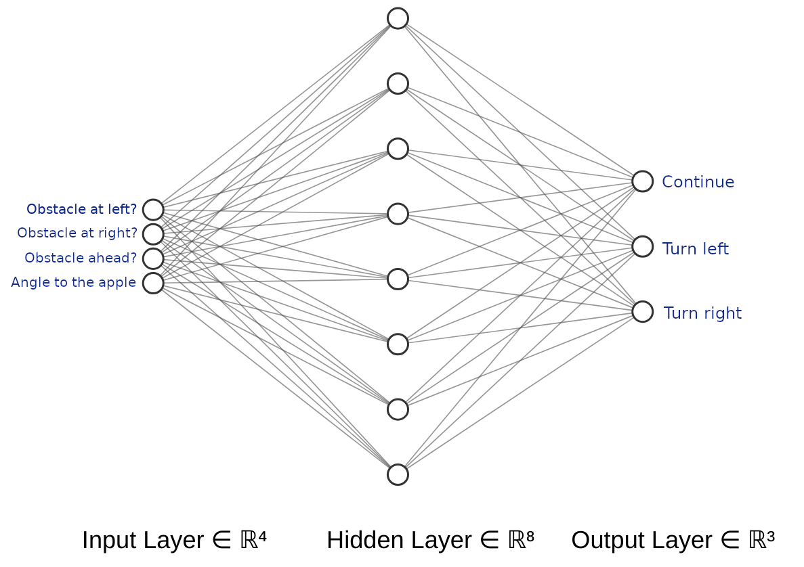

# Snake AI :snake:

An evolutionary algorithm that ajusts the weights of a neural network to control a snake. 

<p align="center">
  <a href="Snake AI">
    
  </a>
</p>

## Prerequisites

* Kivy  
  * See instalation instrutions https://kivy.org

* Install pip dependencies  
  * ```pip install -r requirements.txt```

## Running the program
```
python src/main.py
```

* In the file main.py at lines 123, 124 and 125 we have the variables USE_GUI, USE_SAVE and MANUAL. 
  * USE_GUI enable the visual interface.
  * USE_SAVE makes the program use the file save.pkl as the Snake AI
  * MANUAL let you play the game! :smile:

## AI Learning  
  

- 1° Start #population_size individuals of neural network with random weights.
- 2° The population of neural networks are evaluated and ranked by their fitness.
- 3° Remove some percentage of the population worst individuals.
- 4° Make the crossover.
- 5° Make the mutation.
- 6° Start a new generation.


